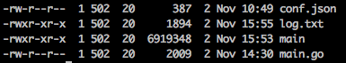
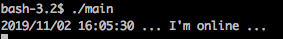
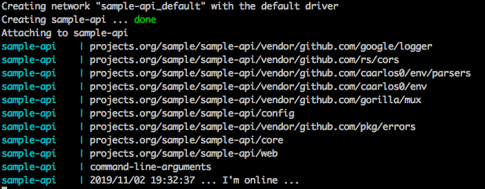

This project is a sample api in Golang created to help beginners in this tool.

### Getting Started
___

##### First you need run two commands for download the dependencies.

```
1 - govendor init: create vendor path.
2 - govendor add +external: Add, inside vendor path, the dependencies.
```

##### Now, we'll started our service. 
> Run the command bellow, inside /cmd path. This command will create a binary file from a Go program.

```
go build main.go
```


##### After build the binary, run the bellow command to run the program.

```
./main
```


or simply

```
docker-compose up
```



### Accessing the routes
___

##### Open your favorite browser and access the link bellow:

````
Request:
http://localhost:8890/api/v1/version/
````

```
Response:
{
    "codResponse":"201",
    "Message":"I'm Ok",
    "version":{
        "major":"1",
        "minor":"0",
        "patch":"0"
    }
}
```

##### Now open the Postman, for exemple.

```
1 - Change the verb HTTP to POST
2 - Add the endpoint:
    - http://localhost:8890/api/v1/process/
3 - Access the aba named Body
```

```
Request:
{
	"code": 1, 
	"name": "Name"
}
```

```
Response:
{
    "codResponse":"201",
    "Message":"Process done...",
    "object":{
            "code":1,
            "name":"Name"
        }
}
```

### License

This project is a sample api in Golang and open source software [licensed as MIT](https://github.com/emersonassis/sample-api/blob/master/LICENSE).
